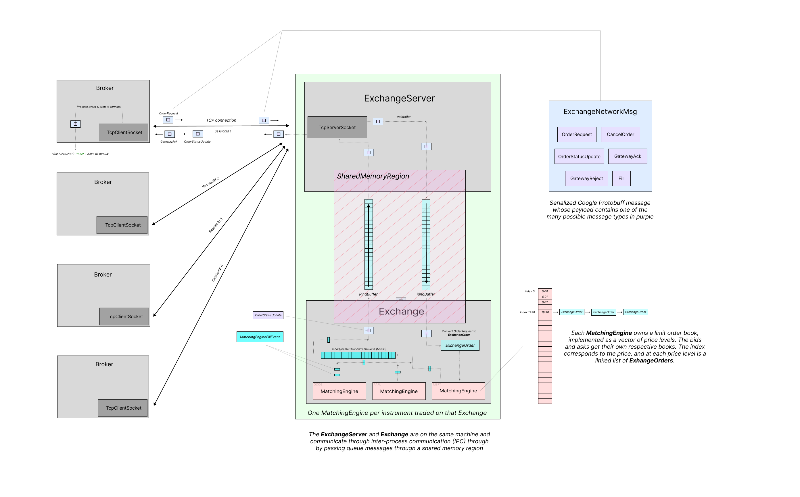
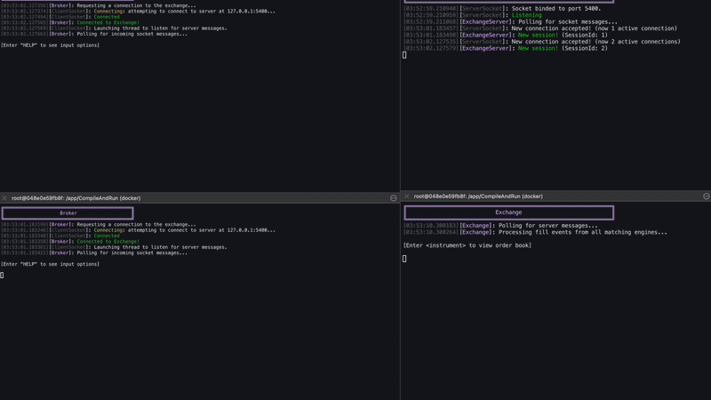
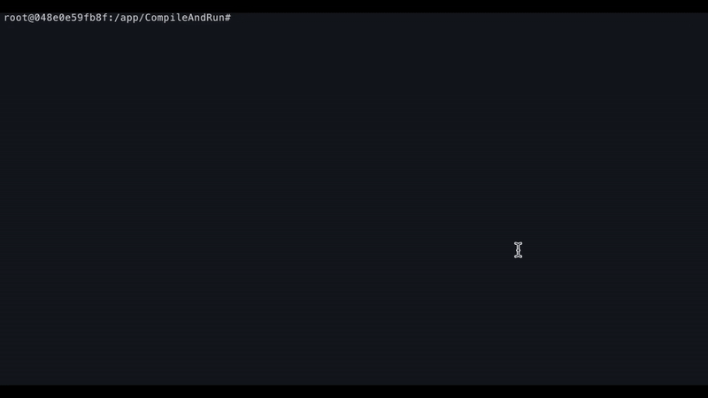
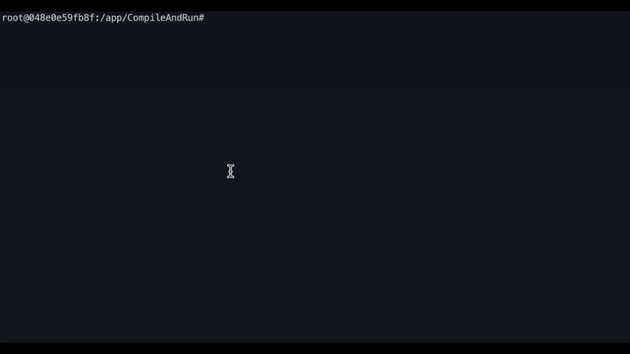
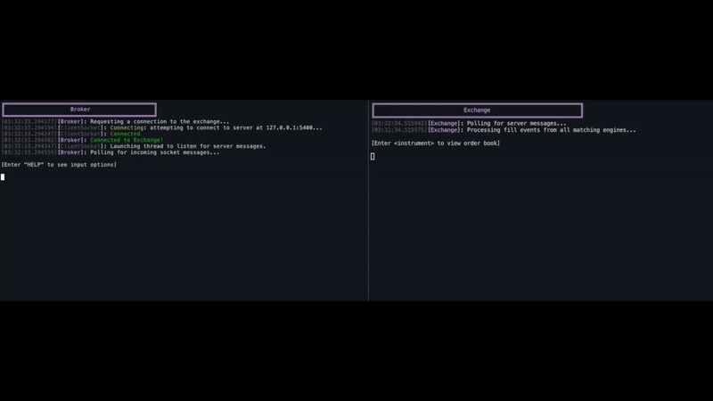
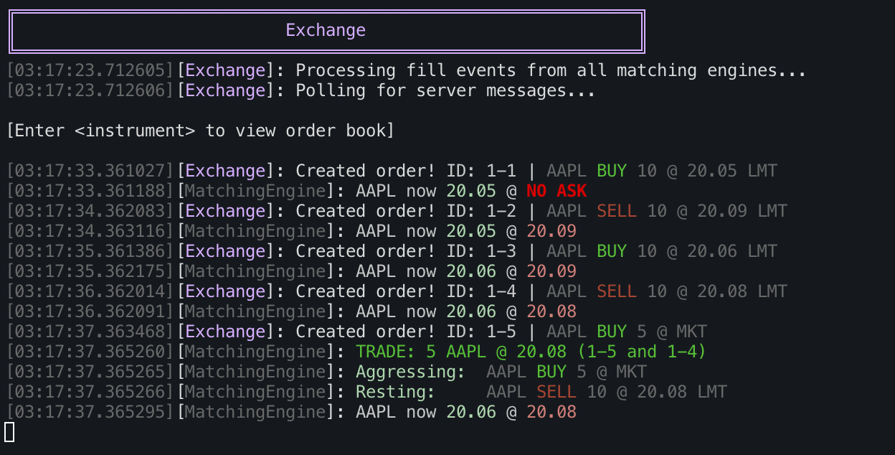
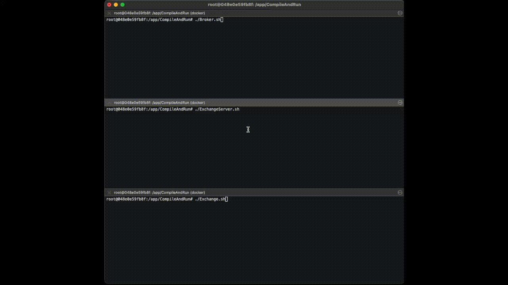

# StockExchange

This is a simple stock exchange simulation. I developed this on my Mac, using Docker to run a Linux container. My goal was to have fun, learn about real-world exchanges, and write good C++!

---------------

 


# Overview

There are three main components to this simulation:
- `Broker`
- `ExchangeServer`
- `Exchange`

The `Broker` sends orders to the `ExchangeServer`, which validates each order and forwards them to the `Exchange`. The `Exchange` tries to fill each order, and sends the resulting events back upstream to the server. The server processes these events, figures out where they need to go, and forwards them back to the correct `Broker`.

I littered my code with comments about things I learned about C++ and low-level programming concepts, as well as broader comments about my system design decisions.

## File Structure & Classes

**`src/core/`**: the code for the core 'business logic'
- `Broker.cpp`
    - Offers APIs to connect to an `ExchangeServer` and place market & limit orders, as well as cancel order requests
    - Processes messages coming from the `ExchangeServer` and displays them in the terminal
- `ExchangeServer.cpp`
    - Manages broker connections
    - Validates broker (order & cancel order) requests
    - Creates the actual order object, assigns it an ID, and forwards it to the `Exchange`
    - Receives messages coming back from the `Exchange`, and routes them back to the proper brokers
    - Manages (creates and destroys) the region of shared memory that is used to facilitate IPC with `Exchange`
- `Exchange.cpp`
    - Receives orders from the `ExchangeServer` and 
    - Owns a `MatchingEngine` for every instrument supported by said Exchange
    - Forwards orders to correct matching engines, and polls for matching engine events and sends them upstream to the `ExchangeServer`
- `MatchingEngine.cpp`
    - Maintains a price-time-priority limit order book
    - Owns the actual orders, and therefore maintains each order's qty remaining and status
    - Matches each new order against resting orders on the opposite side of the book
    - Creates fill events that are sent upstream to the `Exchange`

**`src/misc/`**: the helper classes used by `src/core/`
- `RingBuffer.h`
    - A single-producer single-consumer queue. Used to pass messages between the `Exchange` and the `ExchangeServer` over shared memory IPC
- `TcpSocket/`
    - Contains `TcpClientSocket.cpp` and `TcpServerSocket.cpp`, which are high-level abstractions over raw TCP sockets. They wrap low-level `send()` and `recv()` calls and manage connection lifecycles, buffering, and message framing. Each `Broker` owns a `TcpClientSocket`, while the `ExchangeServer` owns a `TcpServerSocket`. Goal with these was to make it super easy for the owning-apps to send messages.
- `SharedMemoryRegion.cpp`
    - A class to manage a region of shared memory. Abstracts the creation, mapping and cleanup of a named shared memory block. Used for IPC between the `Exchange` and `ExchangeServer`.
- `proto/`
    - contains `messages.proto`, which defines the schema for all the proto messages sent over sockets in the `Broker` and `ExchangeServer`. We also get lazy and use them as a way to structure our queue IPC messages between the `ExchangeServer` and `Exchange`.
- `Logger.cpp`, `Colors.h`, `DebugAssert.h`
    - trivial logging/debug helpers


**`CompileAndRun/`**: contains a script for each core component to clear the terminal, recompile, and relaunch the executable
  -  **`TerminalApps/`**: contains the entry point for each core component's terminal app.


# For simplicity, I decided not to:
- **have the server attempt to track or persist broker identity across connection sessions.** If a broker disconnects and later reconnects—even from the same machine—it is treated as a new, unrelated client. As a result, any messages intended for disconnected brokers are discarded.
- **implement a mechanism for the exchange to broadcast trades to all interested parties.** In a real-world system, this would typically be handled via multicast to publish each trade, or "the tape", to all market participants. Instead, my brokers only receive updates related to their own orders. While this approach is unrealistic for a production-grade exchange, it's a reasonable simplification for the purposes of my project.
- **implement any kernel-bypass techniques in the Exchange.** Currently, my `Exchange` receives messages via a traditional socket buffer. The `TcpServerSocket` it owns uses a thread pool and `epoll()` to handle multiple clients, forwarding all incoming messages into a lock-free queue. The Exchange then dequeues messages sequentially on a separate thread. While this is acceptable for a simulation, it's far too slow for real life trading systems. The kernel's networking stack is slow and unnecessary in performance-critical cases like this.
- **fine tune performance.** While I was planning on benchmarking certain aspects of this project, I gave up after having difficulty using `perf` inside my Docker container. I also didn't want to navigate around all the annoying logging code bloat that I would have had to disable.


# Demos (TerminalApps)

These are demos of the three simple apps in `CompileAndRun/TerminalApps`. Below are some gifs demonstrating some (but certainly not all!) of each app's capabilities. There are a lot of cool edge cases that I tried to cover that aren't displayed in the gifs below, so I encourage you to try the apps out yourself!

## Brokers + ExchangeServer + Exchange
Before zooming in on each individual terminal app, let's take a look at the full simulation.

Here's a quad box of two `Broker` terminals (left), an `ExchangeServer` (top-right), and an `Exchange` (bottom-right). When you type "AUTO" into a `Broker` terminal, the broker sends random $AAPL trades. Watch as the market continuously updates!

The `ExchangeServer` (top-right) can toggle its open/closed status by hitting Enter. When closed, the server rejects the order request.



## `Broker`


A `Broker` connecting to an off-screen `ExchangeServer`, trading with itself (yes this is legal for demo purposes) by placing a limit order then market order. Here are the events the `Broker` received in case the gif was too quick.
```
>> BUY 10 AAPL LMT 19.99
[02:48:05.963046][Broker]: AAPL BUY 10 @ 19.99 LMT     | ID: 1        | Ack          | Ack'd by server
[02:48:05.965138][Broker]: AAPL BUY 10 @ 19.99 LMT     | ID: 1        | New Status   | Accepted
>> SELL 2 AAPL
[02:48:08.470453][Broker]: AAPL SELL 2 @ MKT           | ID: 2        | Ack          | Ack'd by server
[02:48:08.470570][Broker]: AAPL SELL 2 @ MKT           | ID: 2        | New Status   | Accepted
[02:48:08.472290][Broker]: AAPL BUY 10 @ 19.99 LMT     | ID: 1        | Fill         | 2 @ 19.99 (8 remaining)
[02:48:08.472315][Broker]: AAPL BUY 10 @ 19.99 LMT     | ID: 1        | New Status   | Partially Filled
[02:48:08.476230][Broker]: AAPL SELL 2 @ MKT           | ID: 2        | Fill         | 2 @ 19.99
[02:48:08.476251][Broker]: AAPL SELL 2 @ MKT           | ID: 2        | New Status   | Filled
```
You can see the broker gets filled when they send a marketable order.

## `ExchangeServer`


The `ExchangeServer` accepting new `Brokers`. Watch as off-screen `Brokers` connect and disconnect. 

## `Exchange`


A `Broker` (left) sending orders unmarketable limit orders to the `Exchange` (right). The `Exchange` adds them to its book, and when the `Broker` finally sends a marketable order, a trade happens! Watch as the NBBOs update with each limit order.

In addition, When you type a valid instrument into the `Exchange` terminal, it prints that instrument's current Limit Order Book! The book is sorted by price then time. Each individual quantity you see at a price level is a different order.

Here is a screenshot of that would look like (with `Logging::logVerbose` toggled to `true` in `src/misc/Logger.h`): 



## Full Simulation
Here's another view of a full simulation in action. A `Broker` (top) sending orders to an `ExchangeServer` (middle), who is forwarding them to an `Exchange`. 


